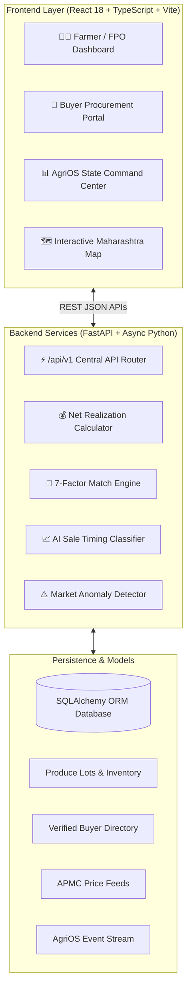

<div align="center">

# 🌾 KisanLink — AgriLink AI
### Intelligent Market Intelligence, Net Realization & Direct Buyer Matching Platform

[](https://fastapi.tiangolo.com)
[](https://reactjs.org)
[](https://www.typescriptlang.org)
[](https://tailwindcss.com)
[](https://vitejs.dev)
[](https://www.docker.com)
[](https://opensource.org/licenses/MIT)

**Smart India Hackathon (SIH) | Problem Statement ID: 26132**  
*Theme: Agriculture, FoodTech & Rural Development*  
*Organization: Government of Maharashtra (Dept of Skills, Employment, Entrepreneurship & Innovation)*

</div>

---

## 📖 Table of Contents
- [🌾 Product Vision](#-product-vision)
- [🏆 The Flagship Benchmark Story](#-the-flagship-benchmark-story)
- [✨ Key Technical Innovations](#-key-technical-innovations)
- [🏗️ System Architecture & Data Flow](#️-system-architecture--data-flow)
- [🧠 Core Mathematical Formulations](#-core-mathematical-formulations)
- [👥 Role-Based Dashboards & Experience](#-role-based-dashboards--experience)
- [📁 Project Structure](#-project-structure)
- [🚀 Quickstart & Installation](#-quickstart--installation)
- [🧪 Running Verification Tests](#-running-verification-tests)
- [📡 API Documentation](#-api-documentation)
- [🌐 Multilingual & Inclusive Design](#-multilingual--inclusive-design)
- [📄 Documentation Links](#-documentation-links)

---

## 🌾 Product Vision

> **“KisanLink doesn't just tell farmers today's price. It calculates WHERE, WHEN, and TO WHOM they should sell to maximize net realization.”**

Smallholder farmers in India suffer from severe market asymmetry, opaque transportation costs, and distress selling. **KisanLink (AgriLink AI)** solves this through algorithmic net realization calculations, an AI sale timing engine, 7-factor buyer compatibility matching, and state-level market surveillance.

---

## 🏆 The Flagship Benchmark Story

```
+-------------------------------------------------------------------------------+
|  PRODUCE: 800 kg Tomato (Grade A) | FARMER: Ramesh Verma (Kanpur, UP)        |
+------------------------------------+------------------------------------------+
|  Traditional Local APMC Mandi      |  KisanLink (AgriLink AI) Platform        |
|  Kanpur Mandi @ ₹28.00/kg          |  Matched Buyer: FreshHarvest Foods       |
|                                    |  Offered Price: ₹33.00/kg (Lucknow Hub)  |
|  - Gross: ₹22,400                  |  - Gross: ₹26,400                        |
|  - Local Logistics: ₹0             |  - Route Logistics (42km): -₹1,600       |
|  -------------------------         |  -------------------------               |
|  - Net Realized: ₹22,400           |  - Net Realized: ₹24,800 (₹31.00/kg net) |
+------------------------------------+------------------------------------------+
|  RESULT: +₹2,240 Extra Net Income (+10.7% Net Gain / +₹2.80 per kg)           |
+-------------------------------------------------------------------------------+
```

---

## ✨ Key Technical Innovations

1. **💰 Net Realization Calculation Engine**: Computes true net realization after subtracting dynamic transport logistics, storage decay, and platform fees.
2. **📈 AI Sale Decision Engine (`SELL_NOW` vs `WAIT` vs `SPLIT_SELL`)**: Evaluates 3-day APMC price forecasts, perishability risk, and buyer reliability to recommend profit-maximizing sale strategies.
3. **🎯 7-Factor Buyer Matching Algorithm**: Multi-factor scoring matching lots on Crop type (25%), Quantity (15%), Quality Grade (15%), Price (15%), Distance (10%), Buyer Reliability (10%), and Payment Velocity (10%).
4. **⚠️ Real-time Price Anomaly Detection**: Z-Score & percentage deviation engine identifying sudden market spikes and distress price crashes across regional mandis.
5. **🛡️ AgriOS Review Queue & Dispute Escrow**: Zero-default digital escrow workflow with human-in-the-loop review queue for quality dispute resolution.
6. **🗺️ Geospatial State Command Center**: Interactive Leaflet/SVG visualization of Maharashtra mandis, FPO aggregation hubs, active logistics routes, and supply clusters.

---

## 🏗️ System Architecture & Data Flow



> 📘 *For comprehensive architecture specifications, see [SYSTEM_DESIGN.md](SYSTEM_DESIGN.md).*

---

## 🧠 Core Mathematical Formulations

### 1. Net Realization Formula
$$\text{Gross} = Q \times P_{\text{offered}}$$
$$\text{Net Realization} = \text{Gross} - C_{\text{transport}} - C_{\text{storage}} - C_{\text{fee}}$$
$$\text{Net/kg} = \frac{\text{Net Realization}}{Q}$$

### 2. 7-Factor Buyer Match Score Formula
$$S = 0.25S_{\text{crop}} + 0.15S_{\text{qty}} + 0.15S_{\text{grade}} + 0.15S_{\text{price}} + 0.10S_{\text{dist}} + 0.10S_{\text{rel}} + 0.10S_{\text{pay}}$$

---

## 👥 Role-Based Dashboards & Experience

Use the **"Judge Demo Mode"** switcher in the top navigation to switch personas instantly:
- **🧑‍🌾 Farmer View**: Produce lot creation wizard, net realization breakdown, buyer offers, AI timing engine.
- **🏢 Buyer View**: Procurement requirements management, matched crop supply feeds, 1-click counter offers.
- **🚜 FPO View**: Bulk aggregation pool, collective negotiation multiplier (+₹35,000 extra realization).
- **📊 State Admin / AgriOS Command Center**: Maharashtra live mandi map, price spike alerts, GMV metrics, and transaction dispute review queue.

---

## 📁 Project Structure

```
AGRI_LINK/
├── backend/                        # FastAPI Backend Application
│   ├── app/
│   │   ├── algorithms/             # Net Realization & Matching Engines
│   │   │   └── engine.py           # Core business logic equations
│   │   ├── models/                 # SQLAlchemy ORM Models
│   │   │   └── all_models.py
│   │   ├── routes/                 # API Endpoints
│   │   │   ├── api_router.py       # Core CRUD & Engine routes
│   │   │   └── agrios_router.py    # AgriOS Event Graph routes
│   │   ├── services/               # Gemini AI & Image Services
│   │   ├── config.py               # Application configurations
│   │   ├── database.py             # Database session manager
│   │   ├── main.py                 # FastAPI application root
│   │   └── seed.py                 # Maharashtra & SIH seed data
│   ├── tests/                      # Pytest Automated Test Suite
│   │   └── test_engine.py          # Critical engine verification tests
│   ├── Dockerfile                  # Backend container build
│   └── requirements.txt            # Python dependencies
│
├── frontend/                       # React 18 + TypeScript + Vite SPA
│   ├── src/
│   │   ├── components/             # Reusable UI & Modal components
│   │   │   ├── AgriOSIntelligenceGraph.tsx
│   │   │   ├── MaharashtraMap.tsx
│   │   │   ├── CreateLotWizardModal.tsx
│   │   │   ├── KisanLinkAIAssistant.tsx
│   │   │   └── Navbar.tsx
│   │   ├── features/               # Role-based Dashboard Views
│   │   │   ├── FarmerDashboard.tsx
│   │   │   ├── BuyerDashboardView.tsx
│   │   │   ├── FPODashboardView.tsx
│   │   │   ├── AdminCommandCenterView.tsx
│   │   │   ├── AgriOSCommandCenterView.tsx
│   │   │   └── MarketIntelligenceView.tsx
│   │   ├── context/                # Global State (Auth, App, Cart)
│   │   ├── data/                   # Crop data & static constants
│   │   ├── services/               # API Clients & Event streaming
│   │   ├── types/                  # TypeScript interface definitions
│   │   └── utils/                  # i18n & Animation helpers
│   ├── Dockerfile                  # Frontend container build
│   └── package.json
│
├── docker-compose.yml              # Multi-container orchestration
├── SYSTEM_DESIGN.md                # In-depth system design & diagrams
├── CONTRIBUTING.md                 # Contribution guidelines
├── LICENSE                         # MIT License
└── README.md                       # Project README
```

---

## 🚀 Quickstart & Installation

### Prerequisites
- **Node.js**: v18.x or higher
- **Python**: v3.10 or higher
- *(Optional)* **Docker & Docker Compose**

---

### Option A: Running with Docker Compose (Recommended)

```bash
docker-compose up --build
```
- Frontend: `http://localhost:3000`
- Backend API Docs: `http://localhost:8000/docs`

---

### Option B: Running Locally

#### 1. Backend Setup
```bash
cd backend

# Create and activate virtual environment
python -m venv venv
# On Windows:
venv\Scripts\activate
# On Linux/macOS:
source venv/bin/activate

# Install dependencies
pip install -r requirements.txt

# Seed initial demonstration database
python app/seed.py

# Start FastAPI server
python app/main.py
```
*Backend runs on `http://localhost:8000` (Swagger docs at `http://localhost:8000/docs`)*

#### 2. Frontend Setup
```bash
cd frontend

# Install dependencies
npm install

# Start Vite development server
npm run dev
```
*Frontend runs on `http://localhost:3000`*

---

## 🧪 Running Verification Tests

To verify the critical mathematical equations and AI recommendation algorithms:

```bash
python backend/tests/test_engine.py
```

Or using `pytest`:
```bash
pytest backend/tests/
```

**Verified Test Cases:**
- ✅ **Net Realization Exactness**: 800 kg @ ₹33/kg with ₹1,600 transport = ₹26,400 Gross, ₹24,800 Net (₹31.00/kg).
- ✅ **AI Decision Engine**: Ramesh Verma's lot evaluates to `SELL_NOW` with +₹2,240 gain vs Kanpur Mandi benchmark.
- ✅ **7-Factor Match Validation**: Strict weighting bounds test.

---

## 📡 API Documentation

Interactive Swagger OpenAPI docs are available at `/docs` when the backend is running.

| Method | Endpoint | Description |
| :--- | :--- | :--- |
| `GET` | `/api/v1/lots` | Retrieve all active produce lots |
| `POST` | `/api/v1/lots` | Post a new harvest lot with AI grade estimation |
| `GET` | `/api/v1/recommendation/{lot_id}` | Generate AI sale timing & net realization calculation |
| `GET` | `/api/v1/requirements` | List active buyer procurement requirements |
| `POST` | `/api/v1/offers` | Create counter or direct purchase offer |
| `GET` | `/api/v1/mandi-prices` | Fetch live APMC mandi benchmarks & price anomalies |
| `GET` | `/api/v1/agrios/events` | Stream live AgriOS state and review queue items |

---

## 🌐 Multilingual & Inclusive Design

KisanLink includes comprehensive localization for rural accessibility:
- 🇮🇳 **English (EN)**
- 🌾 **Hindi (HI - हिंदी)**
- 🚩 **Marathi (MR - मराठी)**

Includes voice-assisted query capability and high-contrast accessibility tags.

---

## 📄 Documentation Links
- 📘 [System Design & Architecture Specification](SYSTEM_DESIGN.md)
- 🤝 [Contribution Guidelines](CONTRIBUTING.md)
- 📜 [MIT License](LICENSE)

---

<div align="center">
  <sub>Built with ❤️ for Indian Farmers & Smart India Hackathon 2026</sub>
</div>
