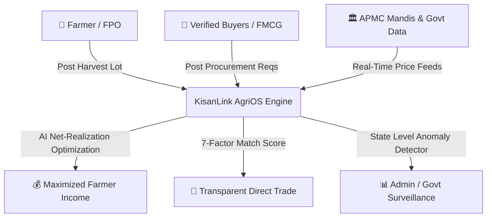
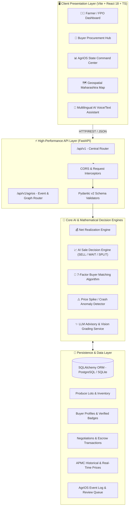
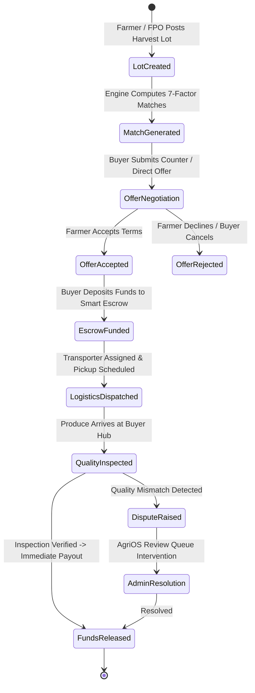
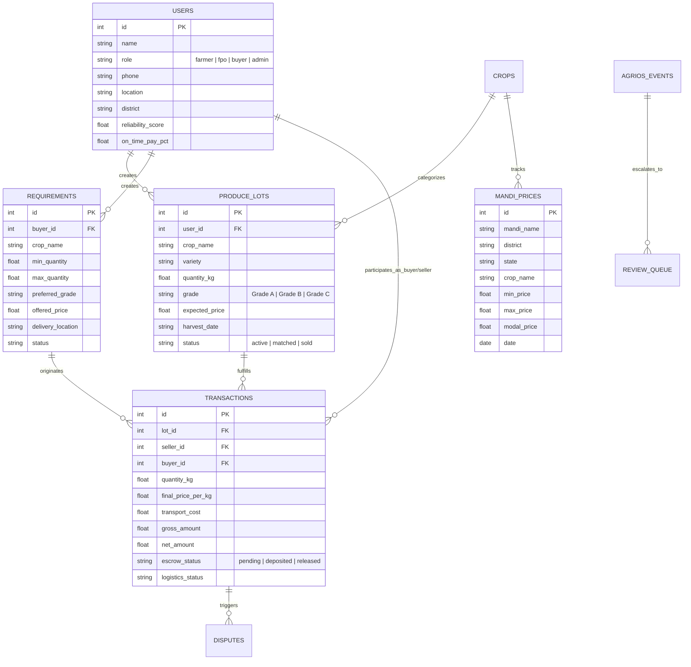

# 🏗️ KisanLink (AgriLink AI) — System Design & Architecture Specification

## 1. Executive Summary & Problem Definition

Indian agriculture faces severe structural market asymmetry. Smallholder farmers often sell their produce to local middlemen at distressed rates due to lack of real-time price intelligence, opaque transport costs, and limited direct access to verified institutional buyers. 

**KisanLink (AgriLink AI)** solves this with an end-to-end intelligent matching, net-realization calculation, and AgriOS supply chain orchestration platform.

---

## 2. High-Level System Architecture

The system is architected as a modern, decoupled cloud-native architecture consisting of:
1. **Client Tier**: Highly responsive React/TypeScript Progressive Web App with Offline-first considerations and multilingual localization (English, Hindi, Marathi).
2. **API Gateway & Routing Layer**: FastAPI high-throughput async gateway with CORS, rate limiting, and schema validation.
3. **Core Intelligence & Business Logic Engines**:
   - **Net Realization Engine**: Dynamic logistics and multi-market net profit calculator.
   - **Sale Recommendation Engine**: Rule-based & heuristic classifier (`SELL_NOW`, `WAIT`, `SPLIT_SELL`).
   - **Buyer Matching Engine**: 7-factor weighted scoring algorithm.
   - **Market Price Anomaly Detector**: Z-Score & threshold deviation engine.
   - **AgriOS Event Stream**: Real-time event sourcing and review queue manager.
4. **Persistence Tier**: Relational schema (SQLAlchemy ORM supporting SQLite/PostgreSQL).

---

## 3. Mathematical Formulations & Decision Engines

### 3.1 Net Realization Engine
The core value proposition for farmers is optimizing net profit rather than gross headline price.

$$\text{Gross Realization} = Q \times P_{\text{buyer}}$$

$$\text{Net Realization} = \text{Gross} - C_{\text{transport}} - C_{\text{storage}} - C_{\text{fee}}$$

$$\text{Net Realization per kg} = \frac{\text{Net Realization}}{Q}$$

$$\Delta \text{Net Profit} = \text{Net}_{\text{buyer}} - \text{Net}_{\text{local mandi}}$$

Where:
- $Q$ = Quantity of produce in kg
- $P_{\text{buyer}}$ = Offered price per kg
- $C_{\text{transport}}$ = Route logistics cost based on distance ($d$) and vehicle class
- $C_{\text{storage}}$ = Daily warehouse / cold storage holding cost
- $C_{\text{fee}}$ = Escrow and platform transaction fee

---

### 3.2 7-Factor Buyer Matchmaking Scoring Formula

The matching engine matches lots with buyer requirements across 7 orthogonal dimensions:

$$S_{\text{total}} = w_1 S_{\text{crop}} + w_2 S_{\text{qty}} + w_3 S_{\text{grade}} + w_4 S_{\text{price}} + w_5 S_{\text{dist}} + w_6 S_{\text{rel}} + w_7 S_{\text{pay}}$$

$$\text{Weights}: [w_1, \dots, w_7] = [0.25, 0.15, 0.15, 0.15, 0.10, 0.10, 0.10]$$

| Factor | Weight | Evaluation Logic |
| :--- | :--- | :--- |
| **Crop Compatibility ($S_{\text{crop}}$)** | 0.25 | $1.0$ if exact match, $0.0$ otherwise |
| **Quantity Match ($S_{\text{qty}}$)** | 0.15 | Ratio of lot quantity to buyer min/max acceptance bounds |
| **Quality Grade Match ($S_{\text{grade}}$)** | 0.15 | $1.0$ if $\text{Grade}_{\text{lot}} \ge \text{Grade}_{\text{buyer}}$, else $0.6$ |
| **Price Alignment ($S_{\text{price}}$)** | 0.15 | Ratio of offered price to farmer expected minimum price |
| **Distance Decay ($S_{\text{dist}}$)** | 0.10 | $\max\left(0.1, 1.0 - \frac{\text{distance (km)}}{200}\right)$ |
| **Buyer Reliability ($S_{\text{rel}}$)** | 0.10 | Historical fulfillment reliability score ($0.0 \dots 1.0$) |
| **Payment Track Record ($S_{\text{pay}}$)** | 0.10 | 24-48h on-time payout compliance percentage |

---

### 3.3 Price Anomaly Detection Formula

Detects rapid APMC market fluctuations and speculative bubbles/crashes:

$$\delta = \left( \frac{P_{\text{mandi}} - \mu_{\text{region}}}{\mu_{\text{region}}} \right) \times 100$$

- **Spike Detected**: $\delta \ge +20.0\%$ (Severity: HIGH if $\delta > 30\%$)
- **Crash Detected**: $\delta \le -20.0\%$ (Severity: HIGH if $\delta < -30\%$)

---

## 4. End-to-End Transaction & Escrow State Machine

---

## 5. Database Schema (Entity-Relationship Diagram)

---

## 6. Security, Compliance & Deployment Strategy

1. **Identity & Authorization**: Role-Based Access Control (RBAC) supporting Farmer, FPO Leader, Buyer Procurement Officer, and State Admin personas.
2. **Financial Escrow Isolation**: Digital smart-contract mock escrow guarantees zero payment default risk for smallholder farmers.
3. **Data Integrity**: Input sanitation via Pydantic v2 and parameterized queries via SQLAlchemy ORM preventing SQL injection.
4. **Deployment Architecture**:
   - Docker containerization for both services.
   - Microservice-ready architecture easily deployable to AWS ECS / GCP Cloud Run / Kubernetes.
   - Scalable to national scale (e-NAM integration ready).

---

## 7. SIH Flagship Validation Benchmark

| Parameter | Traditional Local Mandi | KisanLink (AgriLink AI) |
| :--- | :--- | :--- |
| **Farmer Producer** | Ramesh Verma (Kanpur, UP) | Ramesh Verma (Kanpur, UP) |
| **Commodity** | 800 kg Tomato (Grade A) | 800 kg Tomato (Grade A) |
| **Price Realized** | ₹28.00 / kg (Kanpur Mandi) | ₹33.00 / kg (FreshHarvest Foods, Lucknow) |
| **Transport Cost** | Local (~₹0 - ₹200) | Route Optimized ₹1,600 (42 km) |
| **Gross Total** | ₹22,400 | ₹26,400 |
| **Net Realization** | ₹22,200 | **₹24,800 (₹31.00 / kg)** |
| **Net Gain for Farmer** | *Baseline* | **+₹2,240 (+10.7% net profit)** |
